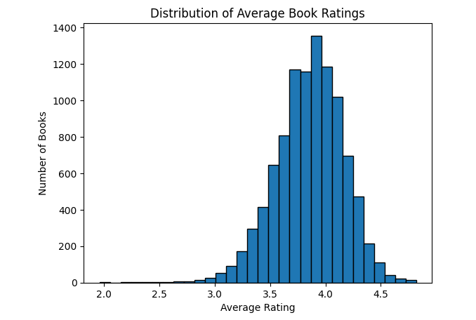

# Collaberative-Filtering-Recommendation-Systems
[In Depth Walk Through / Blog Post](https://medium.com/@justin.donnelly0804/using-machine-learning-to-identify-twitter-spam-acdc05e78b15)

This project creates a model to recommend books/movies based on learned latent factors. This is done using collaberative filtering.The following model was created and trained to learn latent factors about users and books from how they rated the books:

```python
class DotProductBias(Module):
    def __init__(self, n_users, n_books, n_factors, y_range=(0,5.5)):
        self.user_factors = Embedding(n_users,n_factors)
        self.user_bias = Embedding(n_users, 1)
        self.book_factors = Embedding(n_books,n_factors)
        self.book_bias = Embedding(n_books,1)
        self.y_range = y_range
    
    def forward(self,x):
        users = self.user_factors(x[:,0])
        books = self.book_factors(x[:,1])
        residual = (users*books).sum(dim=1, keepdim=True)
        residual += self.user_bias(x[:,0]) + self.book_bias(x[:,1])
        return sigmoid_range(residual, *self.y_range)
```

We create a variable named user factors which is an embedding matrix of size (number of users, number of factors) and do the same with the books as well. 



We also include a bias factor for each book and user as some users may just rate books highly all the time and others may rate them low all the time. Looking at the distribution of ratings, you can see that there is definitely a bias for strong ratings. Furthermore, some books may just be considered popular or better so they receive their own bias as well.

In the forward pass, we define users as all of the rows from the first column, which are all of the user ids. We define books as all of the rows in the second column which are the book ids. When a batch of (user_id, book_id) is passed into the forward method, it will look up each id in the respective embedding matrix and return the latent factors associated with those ids. We then calculate the residual by taking the dot product and then adding the user and book bias and return a squished output using sigmoid range to ensure that the output is between 0 and 5 (range of ratings). Finally, we can train the model. Here, we'll be using 50 latent factors instead of 5:
